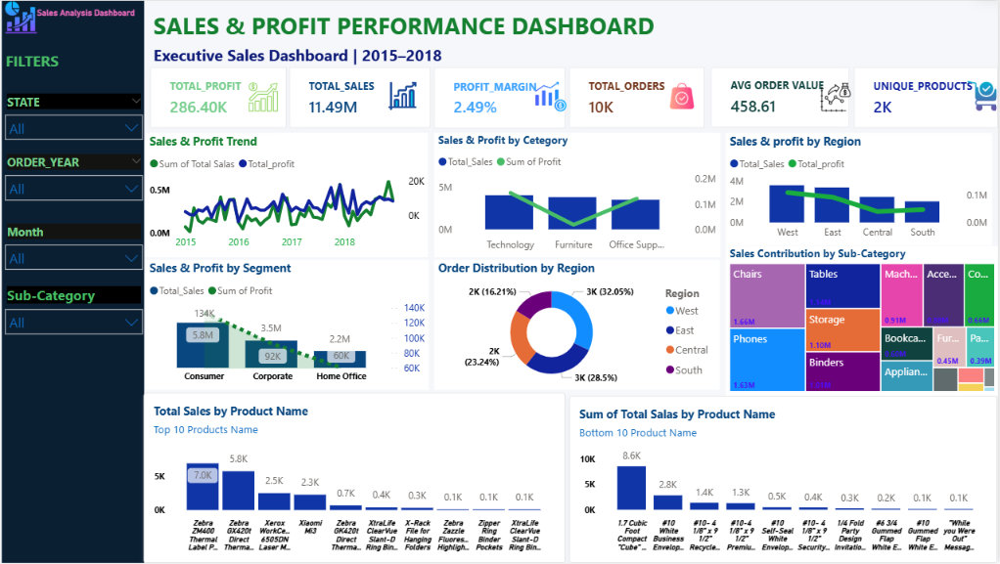

# 📊 Sales Performance Analysis – Power BI

## 📌 Project Overview

This project analyzes sales performance using **Microsoft Power BI** and Superstore sales data.

The objective of this project is to analyze **sales, profit, customer segments, product performance, regional performance, discounts, and returns** and convert raw data into an interactive business dashboard.

The dataset contains **9,994 order records** covering customers, products, sales, quantity, discount, profit, region, and shipping information.

---

## 🛠️ Tools & Technologies

- **Power BI** – Dashboard development and data visualization
- **Power Query** – Data cleaning and transformation
- **DAX** – KPI and business calculations
- **Microsoft Excel** – Source data
- **Data Analysis** – Sales and profitability analysis

---

## 📂 Dataset

The dataset contains three sheets:

- **Orders** – Customer, product, sales, quantity, discount and profit information
- **People** – Regional manager information
- **Returns** – Returned order information

### Key Fields

Sales • Profit • Quantity • Discount • Region • State • Category • Sub-Category • Customer Segment • Ship Mode • Order Date • Product

---

## 🎯 Business Questions

The dashboard was designed to answer:

- What are the total sales and profit?
- Which region performs best?
- Which categories and sub-categories generate the most sales and profit?
- Which products are most and least profitable?
- Which customer segment contributes the most sales?
- How does sales performance change over time?
- How does discounting affect profitability?
- How do returned orders impact performance?
- Which areas require business improvement?

---

## 📊 Dashboard Features

- Total Sales KPI
- Total Profit KPI
- Total Quantity KPI
- Sales by Region
- Profit by Region
- Sales by Category
- Sales by Sub-Category
- Customer Segment Analysis
- Sales Trend Analysis
- Product Performance Analysis
- Discount vs Profit Analysis
- Return Order Analysis
- Interactive Filters & Slicers

---

## 📸 Dashboard Preview



---

## 💡 Key Insights

The dashboard provides a clear view of:

- High-performing and underperforming regions
- Profitable and loss-making products
- Category and sub-category performance
- Customer segment contribution
- Sales trends over time
- Relationship between discounts and profit
- Return order performance

---

## 💼 Business Value

This dashboard converts thousands of raw sales records into an interactive business reporting solution.

It can help management to:

- Monitor sales and profitability
- Identify underperforming products
- Compare regional performance
- Understand customer segments
- Track business trends
- Make data-driven decisions

---

## 🚀 Skills Demonstrated

**Power BI | Power Query | DAX | Data Cleaning | Data Visualization | KPI Development | Business Analysis | Dashboard Development**

---

## 👨‍💻 Project Workflow

**Raw Excel Data → Data Cleaning → Data Transformation → Data Analysis → DAX Calculations → Dashboard Development → Business Insights**

---

## 📁 Repository Structure

```text
Sales-Performance-PowerBI-Dashboard/
│
├── Sales Performance Reports.pbix
├── Superstore.xls
├── dashboard.png
└── README.md
